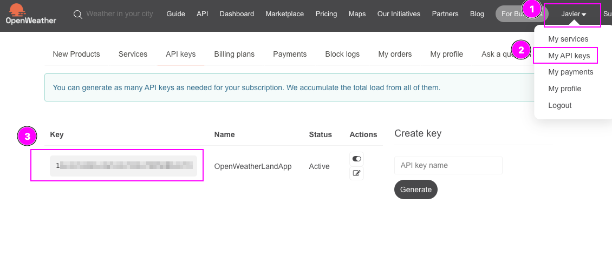
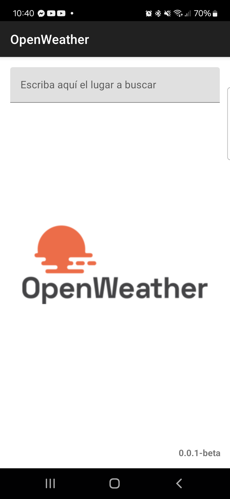
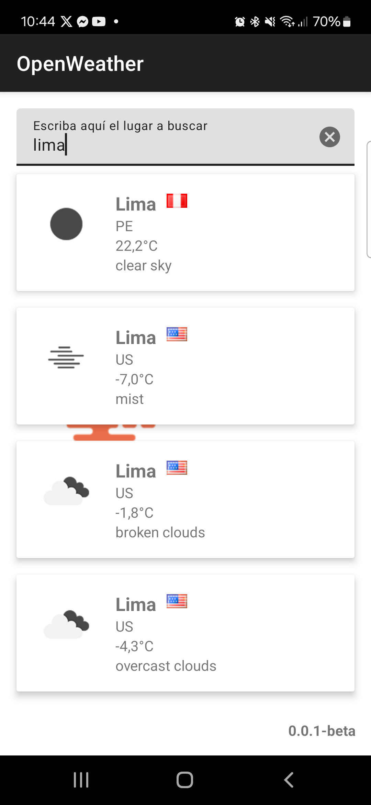
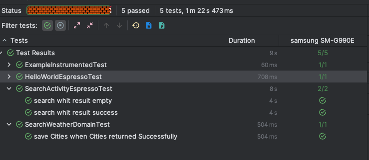

<div align="center">
    


[](https://github.com/usuario/repo/releases) [](https://opensource.org/licenses/MIT) [](https://github.com/usuario/repo/actions)
</div>


# **Android Weather App** ( Test Practico )

Aplicación Android para consultar información de un servicio REST (API pública de clima) y mostrarla en una lista con una barra de búsqueda.

## **Requisitos**

### 1. Android Studio Android Studio Ladybug | 2024.2.1 Patch 3 <br> Build #AI-242.23339.11.2421.12700392, built on November 22, 2024
### 2. Gradle actualizado.


### 3. Configuración de API KEYS

Para ejecutar la aplicación, necesitas proporcionar una API Key de Open Weather.

Sigue estos pasos:
- Dirigite a la página https://openweathermap.org/ y crea una cuenta https://home.openweathermap.org/users/sign_up
- Una ves creada la cuenta y comfirmada tu cuenta, dirigite donde aparece tu nombre (1), desplega el menu escoge API KEY(2) y debes tener una  api key generada (3) ( Link directo: https://home.openweathermap.org/api_keys )
 


- Crea un archivo llamado `gradle.properties` en la raíz del proyecto o utiliza el archivo `~/.gradle/gradle.properties` si prefieres configurarlo de forma local para evitar exponer información sensible.
- En el archivo gradle.properties asigna el valor del api key obtenido a la propiedad OPEN_WEATHER_KEY.

**Ejemplo de `gradle.properties`:**

```properties
## demas propiedades
## ...
OPEN_WEATHER_KEY=tu_api_key_secreta_de_openweather
## ...
```


# Capturas

<div align="left">
    
   

   

   

</div>


# Testing

Se realizaron  3 test, 2 en SearchActivityTest.kt y 1 en WeatherRepositoryTest.kt




# Principales requisitos

1. Interfaz de Usuario:
   ✅ Crear una pantalla principal con una barra de búsqueda en la parte superior y una lista para mostrar los datos.
   ✅ Incluir un diseño limpio y moderno utilizando Material Design.
2. Lógica de Negocio:
   ✅ Consumir datos de una API pública (por ejemplo, la API de OpenWeather https://openweathermap.org/api/one-call-3#how).
   ✅ Mostrar la información relevante en la lista (por ejemplo, nombres de ciudades y temperaturas para la API del clima).
   ✅ Implementar un filtro que permita buscar elementos en la lista basándose en una palabra clave.
3. Persistencia de Datos:
   ✅ Guardar en caché la información descargada para que esté disponible sin conexión.
   ✅ Utilizar Room para almacenar los datos localmente.
4. Buenas Prácticas:
   ✅ Aplicar el patrón MVVM (Model-View-ViewModel).
   ✅ Manejo adecuado de estados de la UI (loading, error, vacío).
   ✅ Escribir al menos un test unitario para la lógica de negocio y un test de UI utilizando JUnit y Espresso.


# Lista de tareas

✅ Setup initial project
✅ Setup material dependency
✅ Setup Koin
✅ Get Api Key Open Weather
✅ POC Postman Api OW test
✅ Setup gradle properties
✅ Setup retrofit
✅ Setup cache
✅ Setup repository
✅ Utils network available
✅ Setup room
✅ Setup Database

✅ Setup search view interactions
✅ Setup view
✅ Setup viewmodel
✅ Setup list view
✅ Setup states

✅ Setup test UI

✅ Setup error handling
✅ Setup loading

✅ Testing UI

✅ Save whit room
✅ Testing logic

✅ Mejora de colores

✅ Finalize readme
✅ Send project


# Notas y referencias usadas

- Guía básica para usar material design en android , views con métodos útiles referente a material design https://m2-material-io.translate.goog/develop/android/docs/getting-started
- Guía para Setup de Koin ( injector de dependencias) https://insert-koin.io/docs/setup/koin#jetpack-compose-or-compose-multiplatform
- La api que se usará es https://api.openweathermap.org/data/2.5/find?q=lima&type=like&sort=population&cnt=30&appid=API_KEY
- Open Weather postman online https://www.postman.com/api-evangelist/openweathermap/request/abttjsn/forecasted-weather?tab=params
- Para imágenes de Open Weather
  - De temperatura: https://openweathermap.org/img/wn/01n@2x.png
  - De banderas: https://openweathermap.org/images/flags/pe.png
  - De localización https://openweathermap.org/weathermap?zoom=12&lat=-12.0432&lon=-77.0282
- Para dudas adicionales de la api OpenWeather tiene su IA Assistant https://openweathermap.org/support-centre
- Room https://developer.android.com/jetpack/androidx/releases/room?hl=es-419
- Test UI espresso https://developer.android.com/training/testing/espresso?hl=es-419
- Para mock se usa https://mockk.io/ para kotlin y simular el viewmodel en las pruebas de la UI ( ref. https://discuss.kotlinlang.org/t/how-to-best-use-mockito-in-kotlin/24675/3 )
- Pruebas con Koin https://proandroiddev.com/easy-instrumented-tests-ui-tests-for-android-in-2021-2e28134ff309
- Para el mockk fue necesario usar los testoptions legacy ( ref. https://stackoverflow.com/questions/73146494/not-able-to-use-mockk-in-android-espresso-ui-testing)


# Deudas técnicas

- No se implementó un diseño modular debido a que no era objetivo desarrollar una aplicación altamente escalable.
- Para las API keys, al ser un proyecto público, se podría utilizar Firebase Secrets, pero esto no se implementó para reducir la complejidad.
- Para monitorizar el estado de la aplicación, se pueden utilizar herramientas como Timber o sistemas de logs más robustos (Sentry, Firebase Crashlytics, etc.).
- Por limitaciones de tiempo, no se añadieron más pruebas, pero quedó una plantilla fácil de replicar para otros casos.

# Soporte y contribuciones
Si tienes dudas adicionales o deseas contribuir al proyecto:
- Crea un issue en el repositorio: https://github.com/JavierSolis/landgorilla-openweather-250103/issues
- Para contribuciones, abre un Pull .

# Contacto

<div align="center">
    
   

#### Javier Solis
👓 https://www.linkedin.com/in/android-developer-peru/
💼 https://www.behance.net/JavierJSolis

</div>


